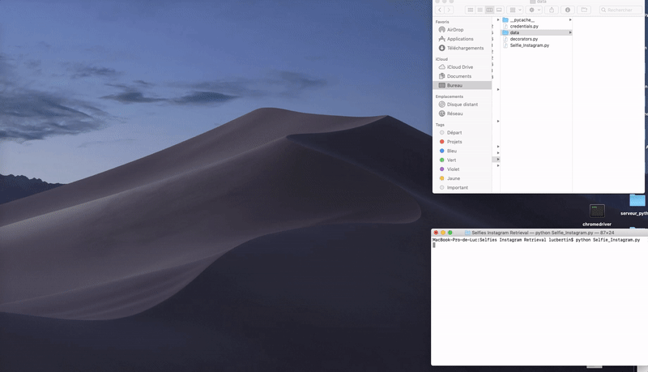
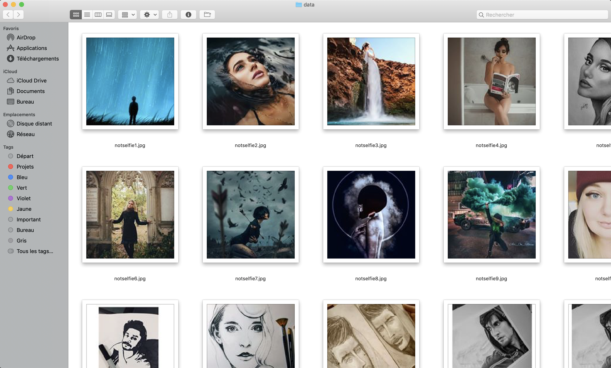
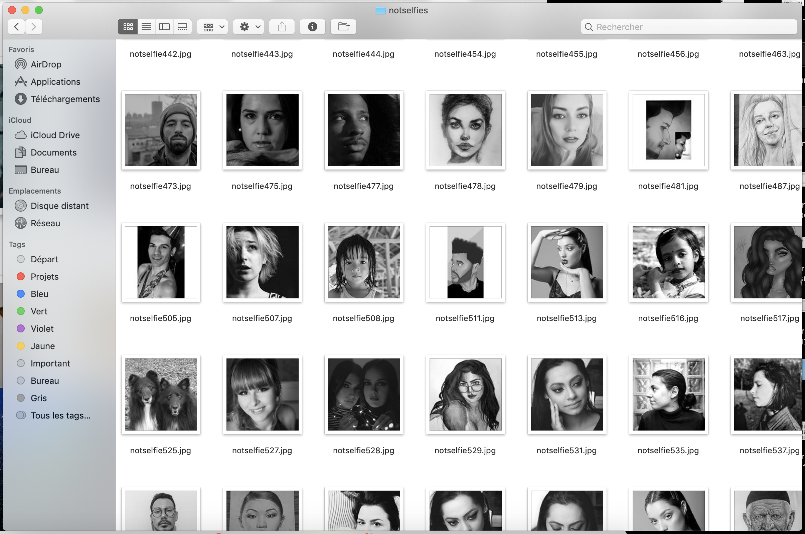

# Training artificial neural network to recognize selfies from autoportraits 

```diff
- This work is in progress. Also I'm still a student so if you'd like to share any feedbacks or to correct me in some point, please do so ! That will always be much appreciated ! 
```

## Introduction

I'm going to use Instagram social network alongside Python 3.0+ with Selenium package for supervised learning classification purposes. As [Facebook deprecated Instagram API Platform](https://www.instagram.com/developer/), and its new Instagram Graph API is a bit tricky to use with 'sandbox' muddle, Selenium library for Python appeared to be a priviledged approach.

## Methods

Following the hasthag #faceportrait and #selfies (or whichever hashtags could best describe what a selfie/or not selfie is), I am going to scrape a certain amount of photos separately looking for people's selfies and self-portraits, so that I'll train my algorithm recognizing which photo is a selfie, and which one is a self-portrait.

Distinction between selfies and self-portraits is based on the definition of the former : "A selfie is a self-portrait photograph taken with a **hand-held** digital camera or camera phone".


### Retrieving data :
To retrieve data, an Instagram account has been created. Explicit waiting conditions on the driver have been used to pass successive pages, authentify, accept and close particular pop-ups (like the one asking you if you want to receive Instagram notifications), as well as enter the hashtags mentioned in command line.

Once done, a loop allows automatic scrolling, based on the previous and next height difference. The scrolling stops if we apply a limit, or if the previous and next height are the same (= the browser has arrived at the bottom of the page), this elegant approach is based on a Stackoverflow thread — (See Selfie_Instagram.py code). The number of function calls allowing the recording of the photos locally is recorded, and thus makes it possible to deduce the names accordingly.

### Cleaning data :
To maximize the homogeneity and cleanliness of the large number of collected data, it was decided to keep only images in which the face of the person is front or slightly inclined using haarcascade_frontalface_default.xml OpenCV haar cascade classifier.

Also, the face of the photographed person must cover a large part of the image, with an area fixed strictly greater than 15% of the image. This avoids pictures taken too far from the camera lens, selfie or not; as well as a second significant advantage in the case of multiple faces detected (by errors or not) and keeps the image only in the case where the widest face is greater than this treshold of 15%.
Any photo that does not respect the aforementionned conditions is simply deleted from the final database. Cleaning, on average, only keeps ⅓ of all initial downloaded photos.

## How to use it 
* *Selfie_Instagram.py* retrieve images from Instagram
It takes as console arguments as much as hashtags names as you want
It ends with a boolean : True if the file needs to be save as selfie or False if it's not.

Example :

```
""" Runnning the script looking for #faceportrait #notselfie and save it as notselfie"""

python Selfie_Instagram.py faceportrait notselfie False
```

* *CleaningPhotos.py* cleans saved images. It takes as console arguments a boolean to define whether it is a Selfie or not

## Demo 

Here is a Selfie_Instagram.py working demo:



## Results

From the scrapping part only, here is a demo of what we can expect so far. 
You will find more detailed explanations inside python files itself.


* Expected data before cleaning :



* After Cleaning :


